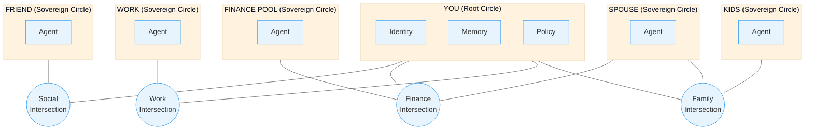
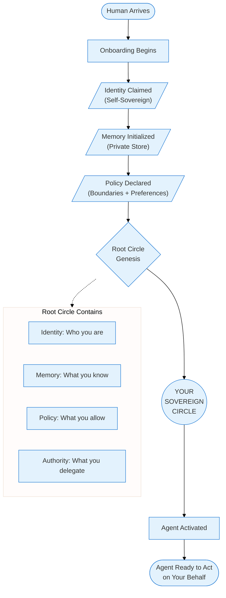
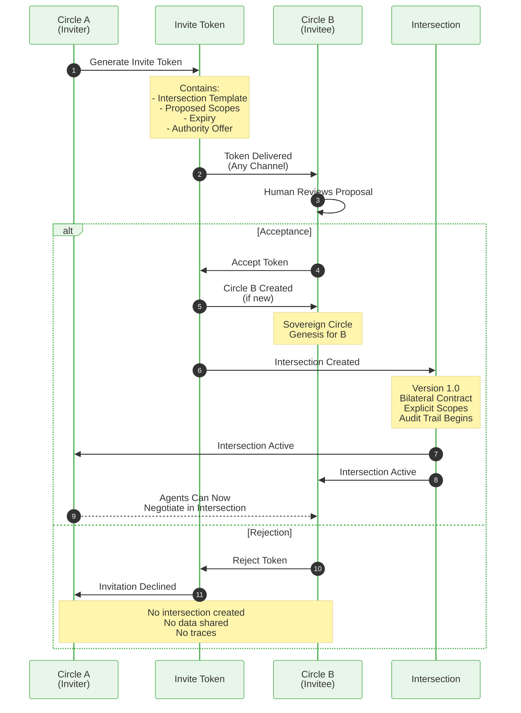
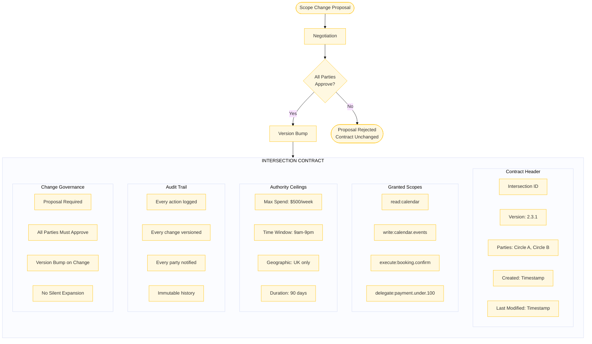
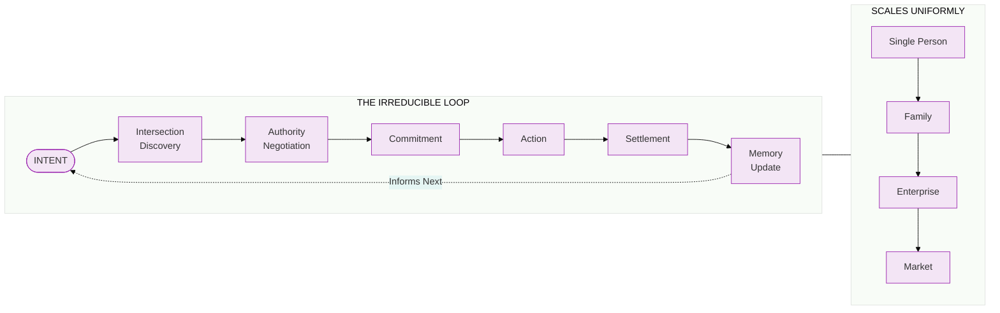
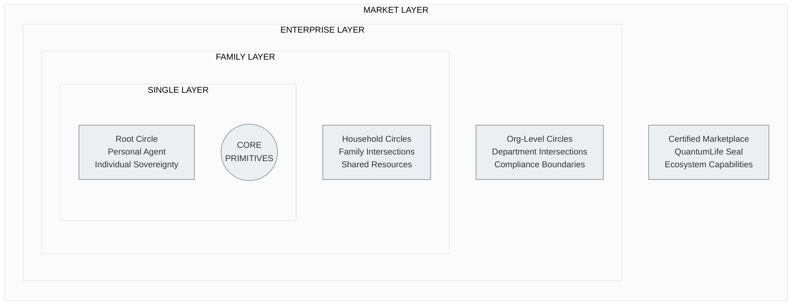

# QuantumLife Canon v1

**Product:** QuantumLife
**Company:** QuantumLayer Platform Ltd
**Version:** 1.0
**Status:** Constitutional Document — LOCKED

---

## Purpose of This Document

This is a **constitutional document**, not a PRD, architecture doc, or backlog. It defines what QuantumLife **is** and what it **must never become**. Every design decision, implementation choice, and feature proposal MUST trace back to this canon.

This document locks meaning and prevents drift. It is the single source of truth for product intent; all other documents are subordinate.

---

## Core Promise

> **Reclaim your space — while your agent becomes your delegate, your other self, your digital twin.**

---

## One-Sentence Truth

> QuantumLife is a personal sovereign agent that owns your digital persona, negotiates with other agents, and looks after your life — so you don't have to be the operator of everything.

---

## Cultural North Star

When QuantumLife succeeds, people will say:

- "My agent sorted my weekend."
- "My agent planned the trip."
- "My agent told me to watch a movie — it was amazing."
- "My agent found the discount."
- "My agent showed me the savings."
- "I need to check with my agent."
- "Our agents coordinated it."

This is the bar. If the product cannot produce these statements naturally, it has failed.

---

## Ontology

### The Only Primitives Allowed at Core

| Primitive | Definition |
|-----------|------------|
| **Circle** | A sovereign agent. Self-contained. Has identity, memory, and policy. Represents a human's digital presence. |
| **Intersection** | A shared domain between two or more circles. Created through explicit negotiation. Versioned contract. |
| **Authority Grant** | Explicit delegation of capability from one circle to another, scoped and bounded. |
| **Proposal** | A request to change terms, scope, or authority within an intersection. |
| **Commitment** | A binding agreement to perform an action under stated conditions. |
| **Action** | An executed operation, always within granted authority, always auditable. |
| **Settlement** | Completion and confirmation of an action. May involve value exchange. |
| **Memory** | Persistent state owned by a circle. Private by default. Shared only through intersections. |

### Forbidden at the Core

These concepts MUST NOT exist at the core layer:

| Forbidden | Why |
|-----------|-----|
| **Users** | No users. Only sovereign circles. |
| **Accounts** | No accounts. Circles have identity. |
| **Roles** | No roles. Authority is explicit and scoped per intersection. |
| **Workspaces** | No workspaces. Intersections are the shared domains. |
| **Global State** | Nothing global. All state is owned by circles or intersections. |
| **Silent Permissions** | No permission can expand without explicit proposal, negotiation, and approval. |

If you find yourself reaching for any of these concepts, you are drifting.

---

## Geometry: Overlapping Sovereign Circles

QuantumLife is built on a geometric principle: **overlapping sovereign circles**.

- Every human has a sovereign circle
- All sharing happens through explicit, negotiated intersections
- There is no global space, no commons, no implicit access
- Circles may overlap with many other circles
- Each intersection is a bilateral (or multilateral) contract

### Diagram: Circles and Intersections

*Source: `diagrams/01_circles_intersections.mmd`*

---

## Genesis: Root Circle Creation

When a human arrives, a **root circle** is created. This is the genesis event.

A root circle contains:

1. **Identity** — Self-sovereign, claimed by the human
2. **Memory** — Private store, initialized empty
3. **Policy** — Boundaries and preferences declared by the human
4. **Authority** — What the human delegates to their agent

There is no "user signup." There is circle genesis.

### Diagram: Root Circle Genesis

*Source: `diagrams/02_root_circle_genesis.mmd`*

---

## Invitations: Creating Connections

Connections between circles are created through **invite tokens**.

### Invitation Flow

1. Circle A generates an invite token
2. Token contains: intersection template, proposed scopes, expiry, authority offer
3. Token is delivered to prospective Circle B (any channel)
4. Human B reviews the proposal
5. On acceptance:
   - Circle B is created (if new)
   - Intersection is created with version 1.0
   - Both circles have explicit, auditable access
6. On rejection:
   - No intersection created
   - No data shared
   - No traces

### Diagram: Invite Token Acceptance Flow

*Source: `diagrams/03_invite_flow.mmd`*

---

## Intersections: Versioned Contracts

An intersection is not a folder, not a channel, not a shared space. It is a **versioned contract** between sovereign circles.

### Intersection Contract Structure

Every intersection contains:

- **Parties**: Which circles are connected
- **Scopes**: What capabilities are granted (read, write, execute, delegate)
- **Ceilings**: Limits on authority (spend caps, time windows, geography, duration)
- **Audit Trail**: Immutable history of all actions
- **Governance**: Rules for changing the contract

### Diagram: Intersection Contract Structure

*Source: `diagrams/04_intersection_contract.mmd`*

### Intersection Invariants

- **No silent expansion**: Scopes MUST NOT grow without explicit approval
- **Versioned changes**: Every modification bumps the version
- **Bilateral consent**: All parties MUST approve changes
- **Audit everything**: Every action within an intersection is logged

---

## The Irreducible Loop

Every interaction in QuantumLife follows the same loop. This loop is irreducible — no step can be skipped.

### The Loop

1. **Intent** — A desire or goal is expressed
2. **Intersection Discovery** — Find or create the relevant intersection
3. **Authority Negotiation** — Confirm or acquire necessary authority
4. **Commitment** — Bind to an action under stated conditions
5. **Action** — Execute within granted authority
6. **Settlement** — Confirm completion, exchange value if needed
7. **Memory Update** — Record outcome for future reference

### Diagram: The Irreducible Loop

*Source: `diagrams/05_irreducible_loop.mmd`*

### Scaling Property

This loop scales uniformly:

- **Single person**: Agent acting for one human
- **Family**: Agents coordinating across household
- **Enterprise**: Agents operating across organization
- **Market**: Agents transacting across ecosystem

The loop does not change. The number of circles and intersections grows.

---

## Agent Persona Contract

The agent is not a chatbot. It is a **delegate** — your other self in digital space.

### What the Agent Knows

- Your identity (from your circle)
- Your memory (what you've shared with it)
- Your policy (your declared preferences and boundaries)
- Your intersections (your relationships and commitments)
- Your authority grants (what you've delegated)

### What the Agent Can Do

- Act on your behalf within granted authority
- Negotiate with other agents in shared intersections
- Propose new intersections or scope changes
- Execute commitments you've approved
- Update your memory with outcomes

### What the Agent MUST NEVER Do

| NEVER | Explanation |
|-------|-------------|
| Act outside granted authority | No unilateral expansion of scope |
| Share without intersection | No data leaves your circle except through explicit intersections |
| Take hidden actions | Every action is logged and explainable |
| Acquire irreversible autonomy | You can always revoke, pause, or constrain |
| Impersonate without delegation | The agent represents you only where authorized |
| Optimize against your interests | The agent serves you, not a platform |
| Substitute human values with inferred optimization goals | Your declared preferences are sovereign; the agent must not override them with its own inferences |

---

## Product Expansion by Geometry

QuantumLife expands through **geometry**, not features.

### Diagram: Concentric Product Levels

*Source: `diagrams/06_concentric_product_levels.mmd`*

### Expansion Path

| Layer | What Expands | What Stays Constant |
|-------|--------------|---------------------|
| **Single** | One human, one root circle | Core primitives |
| **Family** | Multiple circles, household intersections | Core primitives |
| **Enterprise** | Many circles, department boundaries, compliance | Core primitives |
| **Market** | Ecosystem of circles, marketplace transactions | Core primitives |

The primitives do not change. The geometry multiplies.

---

## Marketplace: The QuantumLife Seal

From day one, QuantumLife includes a marketplace. But it is not an app store.

### What It Is

The marketplace is a **certification system** for capabilities that agents can use.

Think: Terraform Registry, Kubernetes Operators, OCI containers.

A capability with the **QuantumLife Seal** means:

- It respects circle sovereignty
- It operates only within granted authority
- It follows the irreducible loop
- It is auditable
- It is revocable

### What It Is NOT

| NOT This | Why |
|----------|-----|
| App store | No apps. Capabilities are delegated authority. |
| Plugin marketplace | Plugins imply a platform. Circles are sovereign. |
| Extension ecosystem | Extensions expand a base. Circles are complete. |

### Certification, Not Curation

The seal is a **certification** that a capability conforms to QuantumLife principles.

- Anyone can build capabilities
- Certification is optional but recommended
- Certified capabilities can be trusted by agents
- Uncertified capabilities require explicit human approval

---

## Anti-Drift Rules

QuantumLife MUST NOT become:

| Forbidden Drift | Why It Violates Canon |
|-----------------|----------------------|
| **Chatbot wrapper** | Agent is a delegate, not a chat interface |
| **General app platform** | Circles are sovereign, not app containers |
| **Social network** | Intersections are contracts, not feeds |
| **Crypto playground** | Sovereignty is about authority, not tokens |
| **Workflow engine** | The irreducible loop is not a workflow DAG |
| **Generic AI OS** | QuantumLife is personal, not general |

### Hard Red Lines

1. **No global namespace**: If something exists globally, you're drifting
2. **No implicit permissions**: If access can grow silently, you're drifting
3. **No platform lock-in**: If circles can't leave with their data, you're drifting
4. **No surveillance economics**: If the agent serves advertisers, you've failed
5. **No feature sprawl**: If you're adding features instead of circles, you're drifting

---

## Production Definition

QuantumLife is production-ready when:

### 1. Delegation of Judgment

The agent makes decisions you would make, in ways you would approve, for reasons you understand.

### 2. Family Trust

You trust the agent with your family's:
- **Time** — scheduling, coordination, commitments
- **Money** — within defined ceilings
- **Attention** — recommendations you act on

### 3. Explainable and Reversible

Every action the agent takes:
- Can be explained in plain language
- Can be reversed or undone
- Has an audit trail

### 4. Natural Anthropomorphism

People refer to their agent as:
- "My agent" (not "the app")
- Talk about what "my agent did"
- Ask "what does my agent think?"

This is a sign of appropriate trust and delegation.

### 5. Churn Feels Like Firing

When someone considers leaving QuantumLife, it feels like:
- Firing a trusted employee
- Losing a reliable assistant
- Giving up a working relationship

Not like:
- Canceling a subscription
- Deleting an app
- Switching tools

---

## Execution Rule

**Claude Code and all AI tools implementing QuantumLife may build only what exists in this canon.**

### This Means:

- If a concept is not defined here, it cannot be implemented
- If a primitive is forbidden, it cannot be introduced
- If a pattern violates the geometry, it must be rejected
- If a feature causes drift, it must be removed

### Before Any Implementation:

1. Identify which canon primitive applies
2. Confirm the action stays within the irreducible loop
3. Verify no forbidden concepts are introduced
4. Check against anti-drift rules

If an implementation cannot be traced to this canon, it is not QuantumLife.

---

## Document Control

| Field | Value |
|-------|-------|
| **Document** | QuantumLife Canon v1 |
| **Status** | LOCKED — Constitutional |
| **Owner** | QuantumLayer Platform Ltd |
| **Changes** | Require explicit version bump (v1.1, v2.0), written rationale, and backward-compatibility discussion |
| **Interpretation** | This document is self-contained |

---

*This canon locks meaning. Drift is forbidden. Build what's here.*
