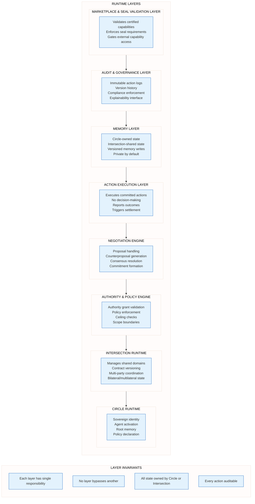
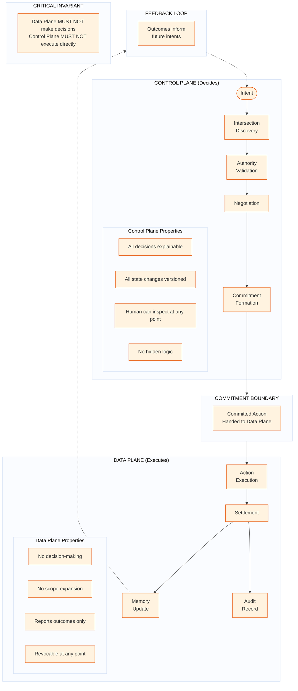
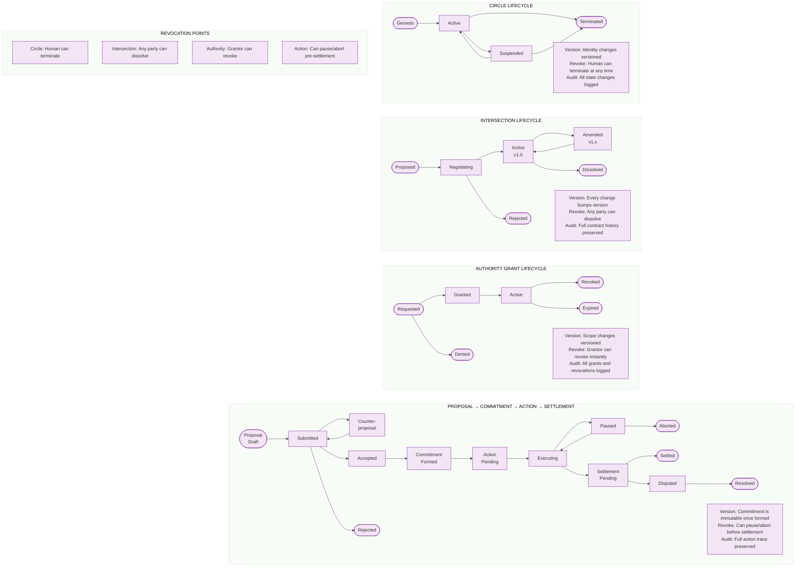

# QuantumLife Technical Split v1

**Product:** QuantumLife
**Company:** QuantumLayer Platform Ltd
**Version:** 1.0
**Status:** Technical Boundary Document — LOCKED

---

## Document Hierarchy

> **This document is subordinate to QuantumLife Canon v1.**
>
> If any statement in this document conflicts with the canon, the canon wins. This document does not extend, reinterpret, or modify the canon. It decomposes the canon into technical responsibilities and boundaries.

---

## 1. Purpose of This Document

This is a **technical boundary and responsibility split** document.

- It defines *what must exist* to make the canon true in production
- It does NOT define *how* anything is built
- It does NOT specify technologies, vendors, languages, or infrastructure
- It assigns responsibilities to runtime layers
- It establishes invariants that implementations MUST satisfy

This document answers: **"What are the technical boundaries and who owns what?"**

It does NOT answer: **"What tools do we use?"**

---

## 2. System Overview (Canon-Aligned)

### The Irreducible Loop

All technical components exist to serve the irreducible loop defined in Canon v1:

1. **Intent** — A desire or goal is expressed
2. **Intersection Discovery** — Find or create the relevant intersection
3. **Authority Negotiation** — Confirm or acquire necessary authority
4. **Commitment** — Bind to an action under stated conditions
5. **Action** — Execute within granted authority
6. **Settlement** — Confirm completion, exchange value if needed
7. **Memory Update** — Record outcome for future reference

### Fundamental Constraint

Every runtime layer, every component, every interface exists to enable this loop. If a component cannot be traced to a step in this loop, it MUST NOT exist.

### Canon Primitives (Reference)

All technical components map to these primitives:

| Primitive | Technical Responsibility |
|-----------|-------------------------|
| **Circle** | Sovereign runtime boundary |
| **Intersection** | Shared contract space |
| **Authority Grant** | Delegated capability with scope |
| **Proposal** | Request for change |
| **Commitment** | Binding agreement |
| **Action** | Executed operation |
| **Settlement** | Confirmed completion |
| **Memory** | Persistent owned state |

---

## 3. Runtime Layers

*Source: `diagrams/07_runtime_layers.mmd`*

---

### 3.1 Circle Runtime

**Responsibility:** Provide the sovereign execution boundary for a single human's digital presence.

| Owns | MUST NOT Own |
|------|--------------|
| Identity (self-sovereign) | Other circles' state |
| Root memory | Intersection contracts (only references) |
| Policy declarations | Global state |
| Authority grant records | Execution of actions outside authority |
| Agent lifecycle | Direct access to other agents |

**Inputs:**
- Human identity claims
- Policy declarations
- Authority delegation decisions

**Outputs:**
- Agent activation signals
- Authority grants (to intersections)
- Memory queries (to memory layer)

**Invariants:**
- A circle MUST be self-contained
- A circle MUST NOT access another circle except through an intersection
- A circle MUST own all its memory
- A circle MUST be able to terminate at any time

---

### 3.2 Intersection Runtime

**Responsibility:** Manage the shared contract space between two or more circles.

| Owns | MUST NOT Own |
|------|--------------|
| Contract state (versioned) | Circle-private memory |
| Party references | Authority beyond what parties granted |
| Scope definitions | Actions (only coordinates them) |
| Audit trail for intersection | Global intersection registry |
| Governance rules | Unilateral change capability |

**Inputs:**
- Proposals from circles
- Authority grants from circles
- Action outcomes (for recording)

**Outputs:**
- Commitment confirmations
- Contract version updates
- Scope change notifications

**Invariants:**
- An intersection MUST be explicitly created (no implicit intersections)
- An intersection MUST NOT expand scope without all-party consent
- An intersection MUST version all changes
- An intersection MUST allow any party to dissolve their participation

---

### 3.3 Authority & Policy Engine

**Responsibility:** Validate all authority grants and enforce policy boundaries.

| Owns | MUST NOT Own |
|------|--------------|
| Authority validation logic | Authority creation (circles create) |
| Policy enforcement rules | Policy definition (circles define) |
| Ceiling checks | Execution of actions |
| Scope boundary enforcement | Memory state |
| Expiry tracking | Negotiation logic |

**Inputs:**
- Authority grant requests
- Policy declarations
- Action authorization requests

**Outputs:**
- Grant/deny decisions
- Ceiling violation alerts
- Scope boundary violations

**Invariants:**
- Authority MUST be explicitly granted (no implicit authority)
- Authority MUST be scoped and bounded
- Authority MUST be revocable
- Policy MUST be enforceable at any point in the loop

---

### 3.4 Negotiation Engine

**Responsibility:** Handle proposals, counterproposals, and commitment formation.

| Owns | MUST NOT Own |
|------|--------------|
| Proposal lifecycle | Final authority decisions |
| Counterproposal generation | Action execution |
| Consensus detection | Memory writes |
| Commitment formation | Policy enforcement |
| Negotiation history | Circle identity |

**Inputs:**
- Proposals from circles/agents
- Authority boundaries (from policy engine)
- Intersection context

**Outputs:**
- Counterproposals
- Commitment records
- Negotiation outcomes

**Invariants:**
- Negotiation MUST be between parties in an intersection
- Negotiation MUST respect authority boundaries
- Commitment MUST require explicit acceptance
- Negotiation history MUST be auditable
- Negotiation MUST NOT assume cooperation; refusal is a valid and expected outcome

---

### 3.5 Action Execution Layer

**Responsibility:** Execute committed actions within granted authority.

| Owns | MUST NOT Own |
|------|--------------|
| Action execution | Decision-making |
| Outcome reporting | Scope expansion |
| Settlement triggering | Authority granting |
| Execution state | Policy interpretation |
| Pause/abort mechanics | Memory ownership |

**Inputs:**
- Committed actions
- Authority confirmation
- Execution parameters

**Outputs:**
- Execution outcomes
- Settlement requests
- Failure reports

**Invariants:**
- This layer MUST NOT make decisions
- This layer MUST NOT expand scope
- This layer MUST report all outcomes
- This layer MUST be pausable and abortable

---

### 3.6 Memory Layer

**Responsibility:** Persist and retrieve state owned by circles and intersections.

| Owns | MUST NOT Own |
|------|--------------|
| Storage operations | Ownership decisions |
| Versioned writes | Access control logic |
| Query interface | Action execution |
| Private-by-default semantics | Negotiation state |
| Memory isolation | Authority grants |

**Inputs:**
- Memory write requests (with ownership proof)
- Memory read requests (with access proof)
- Versioning metadata

**Outputs:**
- Stored state
- Retrieved state
- Version histories

**Invariants:**
- Memory MUST be owned by a circle or intersection
- Memory MUST be private by default
- Memory MUST NOT be shared without explicit intersection
- Memory writes MUST be versioned
- Audit logs MUST NOT be used as operational memory or decision input

---

### 3.7 Audit & Governance Layer

**Responsibility:** Log all actions, enforce governance, and provide explainability.

| Owns | MUST NOT Own |
|------|--------------|
| Immutable action logs | Action execution |
| Version histories | Decision-making |
| Compliance checks | Memory state |
| Explainability interface | Authority granting |
| Governance rule enforcement | Negotiation |

**Inputs:**
- Action records
- State change notifications
- Governance queries

**Outputs:**
- Audit logs
- Compliance reports
- Explanation responses

**Invariants:**
- Every action MUST be logged
- Logs MUST be immutable
- Any action MUST be explainable
- Governance violations MUST be flagged

---

### 3.8 Marketplace & Seal Validation Layer

**Responsibility:** Validate certified capabilities and gate external capability access.

| Owns | MUST NOT Own |
|------|--------------|
| Seal validation logic | Capability execution |
| Certification registry | Authority granting |
| Capability gating | Circle state |
| Trust attestation | Negotiation |

**Inputs:**
- Capability certification claims
- Seal validation requests
- Trust queries

**Outputs:**
- Seal valid/invalid decisions
- Trust attestations
- Certification status

**Invariants:**
- Uncertified capabilities MUST require explicit human approval
- Certified capabilities MUST conform to canon principles
- Seal validation MUST be auditable
- Certification MUST NOT imply automatic trust

---

## 4. Control Plane vs Data Plane

*Source: `diagrams/08_control_vs_data_plane.mmd`*

---

### 4.1 Control Plane

The control plane is responsible for **all decision-making**.

**Components:**
- Intent interpretation
- Intersection discovery
- Authority validation
- Negotiation
- Commitment formation

**Properties:**

| Property | Requirement |
|----------|-------------|
| Explainability | Every decision MUST be explainable in plain language |
| Inspectability | Human MUST be able to inspect any decision point |
| Versioning | All state changes MUST be versioned |
| No hidden logic | No decision can happen without audit trail |

**Critical Invariant:** The control plane MUST NOT directly execute actions. It produces commitments; the data plane executes them.

---

### 4.2 Data Plane

The data plane is responsible for **execution only**.

**Components:**
- Action execution
- Settlement
- Memory writes
- Audit logging

**Properties:**

| Property | Requirement |
|----------|-------------|
| No decisions | MUST NOT make decisions |
| No expansion | MUST NOT expand scope |
| Outcome reporting | MUST report all outcomes |
| Revocability | MUST be pausable and abortable |

**Critical Invariant:** The data plane MUST NOT make decisions. It executes what the control plane has committed.

---

### 4.3 The Commitment Boundary

The handoff between control plane and data plane happens at **commitment formation**.

- Before commitment: control plane decides
- At commitment: action is bound and handed off
- After commitment: data plane executes

This boundary prevents "smart execution layers" — execution logic that makes decisions disguised as execution.

**Invariant:** No logic in the data plane may alter, expand, or interpret the committed action.

---

## 5. Lifecycle Definitions

*Source: `diagrams/09_lifecycle_overview.mmd`*

---

### 5.1 Circle Lifecycle

| State | Description | Transitions |
|-------|-------------|-------------|
| **Genesis** | Circle is created; identity claimed | → Active |
| **Active** | Circle is operating normally | → Suspended, → Terminated |
| **Suspended** | Circle is paused (human decision) | → Active, → Terminated |
| **Terminated** | Circle is permanently ended | Terminal state |

**Invariants:**
- Genesis MUST capture identity, policy, and initial memory
- Termination MUST be available at any time (human sovereignty)
- All state changes MUST be versioned
- Termination MUST preserve audit history

---

### 5.2 Intersection Lifecycle

| State | Description | Transitions |
|-------|-------------|-------------|
| **Proposed** | Intersection is proposed via invite | → Negotiating |
| **Negotiating** | Terms are being discussed | → Active, → Rejected |
| **Active** | Intersection is operational (versioned) | → Amended, → Dissolved |
| **Amended** | Terms are being modified | → Active |
| **Rejected** | Proposal was declined | Terminal state |
| **Dissolved** | Intersection is ended | Terminal state |

**Invariants:**
- Creation MUST require explicit acceptance from all parties
- Every change MUST bump the version
- Any party MUST be able to dissolve
- Dissolution MUST preserve audit history

---

### 5.3 Authority Grant Lifecycle

| State | Description | Transitions |
|-------|-------------|-------------|
| **Requested** | Authority is requested | → Granted, → Denied |
| **Granted** | Authority is approved | → Active |
| **Denied** | Authority request declined | Terminal state |
| **Active** | Authority is in effect | → Revoked, → Expired |
| **Revoked** | Authority withdrawn by grantor | Terminal state |
| **Expired** | Authority reached time limit | Terminal state |

**Invariants:**
- Grants MUST be explicit (no implicit authority)
- Grants MUST have scope and ceilings
- Revocation MUST be immediate when requested
- All grants and revocations MUST be logged

---

### 5.4 Proposal → Commitment Lifecycle

| State | Description | Transitions |
|-------|-------------|-------------|
| **Draft** | Proposal is being formed | → Submitted |
| **Submitted** | Proposal sent to parties | → Accepted, → Rejected, → Counterproposal |
| **Counterproposal** | Modified proposal returned | → Submitted |
| **Accepted** | All parties agree | → Commitment Formed |
| **Rejected** | Proposal declined | Terminal state |

**Invariants:**
- Acceptance MUST be explicit from all required parties
- Counterproposals MUST be versioned
- Commitment MUST be immutable once formed

---

### 5.5 Action → Settlement Lifecycle

| State | Description | Transitions |
|-------|-------------|-------------|
| **Pending** | Committed action awaiting execution | → Executing |
| **Executing** | Action is in progress | → Paused, → Settlement Pending |
| **Paused** | Execution halted | → Executing, → Aborted |
| **Aborted** | Execution cancelled | Terminal state |
| **Settlement Pending** | Execution complete, awaiting settlement | → Settled, → Disputed |
| **Disputed** | Settlement contested | → Resolved |
| **Settled** | Action complete and confirmed | Terminal state |
| **Resolved** | Dispute resolved | Terminal state |

**Invariants:**
- Actions MUST be pausable before settlement
- Abort MUST be possible before settlement
- Settlement MUST confirm completion
- Disputes MUST have resolution path
- Full trace MUST be preserved

---

## 6. Failure, Revocation, and Safety Semantics

### 6.1 Authority Revocation Mid-Action

When authority is revoked while an action is executing:

1. Execution layer MUST receive revocation signal immediately
2. Execution MUST pause at next safe point
3. Partial work MUST be logged
4. Settlement MUST NOT proceed
5. Action MUST transition to Aborted state
6. All parties MUST be notified

**Invariant:** Revocation MUST halt execution. There is no "finish what you started" exception.

---

### 6.2 Action Pause and Abort

**Pause semantics:**
- Human or system can request pause
- Execution halts at next safe point
- State is preserved
- Can resume or abort from paused state

**Abort semantics:**
- Execution is permanently cancelled
- Partial work is logged but not settled
- Authority is released
- All parties are notified

**Invariant:** Pause and abort MUST be available at any time before settlement.

---

### 6.3 Trust Degradation

Trust degradation occurs when:
- A party consistently fails commitments
- Authority is frequently revoked
- Actions frequently abort
- Disputes are frequent

**System response:**
- Trust degradation MUST be logged
- Trust status MUST be queryable
- Degraded trust MAY affect negotiation
- Trust MUST NOT be silently restored

**Invariant:** Trust changes MUST be explicit and auditable.

---

### 6.4 Safe Failure Definition

In QuantumLife, "safe failure" means:

| Property | Requirement |
|----------|-------------|
| No silent failure | Every failure MUST be logged and notified |
| No partial settlement | Failure before settlement means no settlement |
| Reversibility | Failed actions MUST NOT create irreversible side effects where possible |
| Audit preservation | Failure history MUST be preserved |
| Authority release | Failed actions MUST release held authority |
| State consistency | Memory MUST remain consistent after failure |

**Invariant:** Failure MUST leave the system in a known, consistent, auditable state.

---

## 7. Non-Goals (Anti-Drift, Technical)

This system MUST NOT become:

| Anti-Pattern | Why It Violates Canon |
|--------------|----------------------|
| **Global scheduler** | No global state; circles are sovereign |
| **Implicit shared state** | All sharing is through explicit intersections |
| **Agent omniscience** | Agents know only what circles share |
| **Hidden side effects** | Every action is logged and auditable |
| **Uncontrolled async** | All operations are traceable and interruptible |
| **Smart execution layer** | Data plane does not make decisions |
| **Central authority** | No entity has authority over circles |
| **Ambient permissions** | All permissions are explicit grants |

### Technical Red Lines

1. **No global namespace**: If something is addressable globally without intersection, reject it
2. **No implicit state sharing**: If data flows without intersection contract, reject it
3. **No decision-making in execution**: If the data plane interprets or decides, reject it
4. **No unversioned changes**: If state changes without version bump, reject it
5. **No silent authority expansion**: If scope grows without explicit approval, reject it
6. **No unauditable actions**: If an action cannot be explained, reject it

---

## 8. Readiness for Technology Selection

### Questions Now Answerable

After this document, the following questions can be answered:

| Question | Answer Source |
|----------|---------------|
| What components must exist? | Section 3: Runtime Layers |
| What does each component own? | Section 3: Layer definitions |
| What is the decision/execution boundary? | Section 4: Control vs Data Plane |
| What are the entity lifecycles? | Section 5: Lifecycle Definitions |
| How does failure work? | Section 6: Safety Semantics |
| What must the system never become? | Section 7: Non-Goals |

### Questions Intentionally Deferred

| Question | Deferred To |
|----------|-------------|
| What programming language? | Technology Selection Document |
| What database/storage? | Technology Selection Document |
| What LLM/model for agents? | Technology Selection Document |
| What message format? | Technology Selection Document |
| What deployment model? | Technology Selection Document |
| What authentication mechanism? | Technology Selection Document |
| What API protocol? | Technology Selection Document |

### Next Step

The next document is **Technology Selection**, which will:
- Choose specific technologies for each layer
- Define interfaces between layers
- Specify data formats
- Select infrastructure components

That document will be subordinate to both:
1. QuantumLife Canon v1 (meaning)
2. This Technical Split v1 (boundaries)

---

## Document Control

| Field | Value |
|-------|-------|
| **Document** | QuantumLife Technical Split v1 |
| **Status** | LOCKED — Technical Boundary |
| **Owner** | QuantumLayer Platform Ltd |
| **Subordinate To** | QuantumLife Canon v1 |
| **Changes** | Require explicit version bump (v1.1, v2.0), written rationale, and canon compliance review |
| **Conflict Resolution** | Canon wins |

---

*This document defines boundaries. Technology choices come next. Canon compliance is mandatory.*
