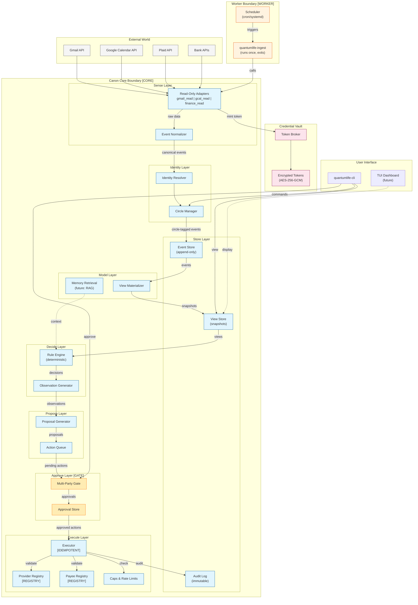

# Level 0 Architecture Block Diagram

System-level view of QuantumLife Canon showing all major components and guardrail boundaries.

## System Block Diagram



## Component Descriptions

### Canon Core Boundary [CORE]

All components within this boundary follow Canon v9+ guardrails:

| Guardrail | Enforcement |
|-----------|-------------|
| No background execution | Single-run commands only, no goroutines in core |
| Deterministic clock | `clock.Clock` interface injected at entry points |
| Single trace finalization | One trace ID per request, finalized before return |
| No auto-retry | Failures surface immediately, caller decides retry |

### Worker Boundary [WORKER]

External schedulers (cron, systemd timers) trigger ingestion:

```bash
# Example: Run ingestion every 15 minutes
*/15 * * * * /usr/local/bin/quantumlife-ingest --mode=real --circle=family
```

### Multi-Party Gate [GATE]

Financial execution requires multi-party approval:

- Threshold-based (e.g., 2-of-3 approvers)
- Action hash binding prevents tampering
- Approval artifacts are signed and stored

### Registry Locks [REGISTRY]

- **Provider Registry**: Only registered write providers can execute
- **Payee Registry**: Only registered payees can receive funds

### Idempotency [IDEMPOTENT]

Every execution carries an idempotency key:

- SHA-256 hash of (action_type, parameters, timestamp window)
- Duplicate detection before provider call
- Replay defense across restarts

## Data Flow Summary

```
External APIs → Adapters → Normalizer → Identity → EventStore → ViewMaterializer → ViewStore
                                                                       ↓
                                                                  RuleEngine
                                                                       ↓
                                                               ProposalGenerator
                                                                       ↓
                                                                MultiPartyGate
                                                                       ↓
                                                                  Executor → AuditLog
```

## Related

- [CLOSED_LOOP_LIFECYCLE.md](CLOSED_LOOP_LIFECYCLE.md) - Detailed lifecycle stages
- [TRUST_BOUNDARIES.md](TRUST_BOUNDARIES.md) - Security trust zones
- [CONTROL_DATA_PLANE.md](CONTROL_DATA_PLANE.md) - Plane separation
