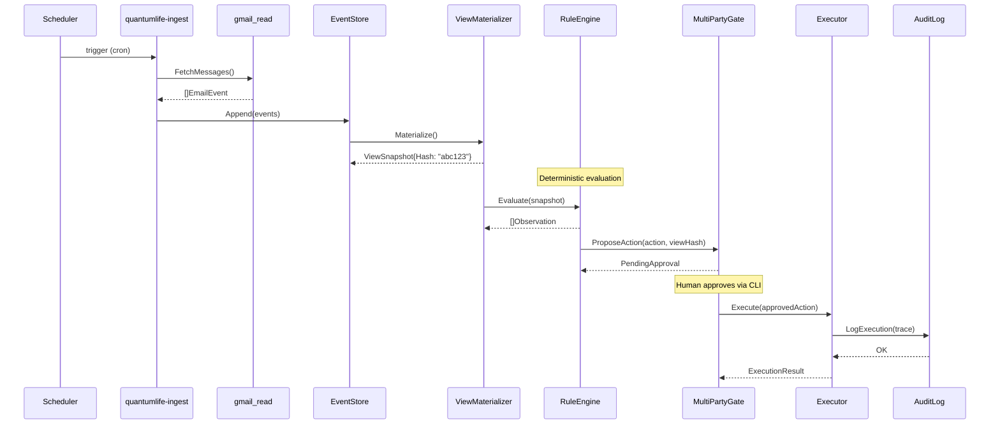

# Closed-Loop Lifecycle

The complete QuantumLife Canon lifecycle: Sense → Normalize → Identity → Store → View → Decide → Propose → Approve → Execute → Audit → Learn

## Lifecycle Flow Diagram

```mermaid
flowchart TB
    subgraph "SENSE"
        S1["External APIs<br/>(Gmail, GCal, Plaid)"]
        S2["Read-Only Adapters"]
        S1 -->|"raw data"| S2
    end

    subgraph "NORMALIZE"
        N1["Schema Validation"]
        N2["Canonical Event Creation"]
        N3["Timestamp Normalization<br/>(deterministic clock)"]
        S2 -->|"provider-specific"| N1
        N1 --> N2
        N2 --> N3
    end

    subgraph "IDENTITY"
        I1["Entity Resolution"]
        I2["Circle Assignment"]
        I3["Relationship Mapping"]
        N3 -->|"canonical event"| I1
        I1 --> I2
        I2 --> I3
    end

    subgraph "STORE"
        ST1["Event Store<br/>(append-only)"]
        ST2["Idempotency Check"]
        ST3["v9.6 Replay Defense"]
        I3 -->|"circle-tagged event"| ST2
        ST2 -->|"new event"| ST1
        ST2 -->|"duplicate"| ST3
        ST3 -->|"reject"| AUDIT
    end

    subgraph "VIEW"
        V1["View Materializer"]
        V2["Snapshot Generation"]
        V3["Hash Computation<br/>(v9.12 binding)"]
        ST1 -->|"events"| V1
        V1 --> V2
        V2 --> V3
    end

    subgraph "DECIDE"
        D1["Rule Engine<br/>(deterministic)"]
        D2["Threshold Evaluation"]
        D3["Observation Generation"]
        V3 -->|"view snapshot"| D1
        D1 --> D2
        D2 --> D3
    end

    subgraph "PROPOSE"
        P1["Proposal Generator"]
        P2["Action Templating"]
        P3["View Freshness Binding<br/>(v9.13)"]
        D3 -->|"observations"| P1
        P1 --> P2
        P2 --> P3
    end

    subgraph "APPROVE"
        A1["Multi-Party Gate<br/>(v9.10/9.9)"]
        A2["Threshold Check<br/>(e.g., 2-of-3)"]
        A3["Approval Artifact Storage"]
        P3 -->|"proposal"| A1
        A1 --> A2
        A2 -->|"approved"| A3
        A2 -->|"rejected"| AUDIT
    end

    subgraph "EXECUTE"
        E1["Provider Registry Lock<br/>(v9.9)"]
        E2["Payee Registry Lock<br/>(v9.10)"]
        E3["Caps & Rate Limits<br/>(v9.11)"]
        E4["Executor<br/>(idempotent)"]
        A3 -->|"approved action"| E1
        E1 --> E2
        E2 --> E3
        E3 --> E4
    end

    subgraph "AUDIT"
        AU1["Audit Event Emission"]
        AU2["Immutable Log Append"]
        AU3["Trace Finalization"]
        E4 -->|"result"| AU1
        AU1 --> AU2
        AU2 --> AU3
    end

    subgraph "LEARN"
        L1["Outcome Recording"]
        L2["Pattern Detection<br/>(future)"]
        L3["Rule Refinement<br/>(future)"]
        AU3 -->|"audit trail"| L1
        L1 -.-> L2
        L2 -.-> L3
        L3 -.->|"updated rules"| D1
    end

    %% Styling
    classDef sense fill:#e3f2fd,stroke:#1565c0
    classDef normalize fill:#e8f5e9,stroke:#2e7d32
    classDef identity fill:#fff3e0,stroke:#ef6c00
    classDef store fill:#fce4ec,stroke:#c2185b
    classDef view fill:#f3e5f5,stroke:#7b1fa2
    classDef decide fill:#e0f7fa,stroke:#00838f
    classDef propose fill:#fff8e1,stroke:#f9a825
    classDef approve fill:#ffecb3,stroke:#ff6f00
    classDef execute fill:#ffebee,stroke:#c62828
    classDef audit fill:#eceff1,stroke:#455a64
    classDef learn fill:#e8eaf6,stroke:#3949ab

    class S1,S2 sense
    class N1,N2,N3 normalize
    class I1,I2,I3 identity
    class ST1,ST2,ST3 store
    class V1,V2,V3 view
    class D1,D2,D3 decide
    class P1,P2,P3 propose
    class A1,A2,A3 approve
    class E1,E2,E3,E4 execute
    class AU1,AU2,AU3 audit
    class L1,L2,L3 learn
```

## Stage Details

### 1. SENSE

**Purpose**: Ingest raw data from external providers

| Component | Responsibility |
|-----------|----------------|
| External APIs | Gmail, Google Calendar, Plaid, bank APIs |
| Read-Only Adapters | Provider-specific HTTP clients, read-only by design |

**Canon Guardrails**:
- No write methods exist in adapter interfaces
- OAuth scopes restricted to read-only
- Token broker mints read-only access tokens

### 2. NORMALIZE

**Purpose**: Convert provider-specific data to canonical events

| Component | Responsibility |
|-----------|----------------|
| Schema Validation | Reject malformed data at boundary |
| Canonical Event Creation | Map to domain event types |
| Timestamp Normalization | Use injected `clock.Clock`, never `time.Now()` |

### 3. IDENTITY

**Purpose**: Resolve entities and assign to circles

| Component | Responsibility |
|-----------|----------------|
| Entity Resolution | Match emails, names, accounts to entities |
| Circle Assignment | Tag events with owning circle |
| Relationship Mapping | Build entity relationship graph |

### 4. STORE

**Purpose**: Persist events with replay defense

| Component | Responsibility |
|-----------|----------------|
| Event Store | Append-only event log |
| Idempotency Check | Detect duplicates by content hash |
| v9.6 Replay Defense | Reject replayed events with same idempotency key |

### 5. VIEW

**Purpose**: Materialize queryable views from events

| Component | Responsibility |
|-----------|----------------|
| View Materializer | Compute views from event streams |
| Snapshot Generation | Create point-in-time snapshots |
| Hash Computation | v9.12 policy snapshot hash for binding |

### 6. DECIDE

**Purpose**: Evaluate rules and generate observations

| Component | Responsibility |
|-----------|----------------|
| Rule Engine | Deterministic rule evaluation |
| Threshold Evaluation | Compare values against thresholds |
| Observation Generation | Neutral language, no urgency/fear |

### 7. PROPOSE

**Purpose**: Generate action proposals from observations

| Component | Responsibility |
|-----------|----------------|
| Proposal Generator | Create actionable proposals |
| Action Templating | Structure execution parameters |
| View Freshness Binding | v9.13 bind proposal to view hash |

### 8. APPROVE

**Purpose**: Multi-party approval before execution

| Component | Responsibility |
|-----------|----------------|
| Multi-Party Gate | Require multiple approvers (v9.10/9.9) |
| Threshold Check | Verify approval count meets policy |
| Approval Artifact Storage | Store signed approvals |

### 9. EXECUTE

**Purpose**: Execute approved actions with safety checks

| Component | Responsibility |
|-----------|----------------|
| Provider Registry Lock | v9.9 - only registered providers |
| Payee Registry Lock | v9.10 - only registered payees |
| Caps & Rate Limits | v9.11 - enforce spending limits |
| Executor | Idempotent execution with trace |

### 10. AUDIT

**Purpose**: Record all actions immutably

| Component | Responsibility |
|-----------|----------------|
| Audit Event Emission | Create detailed audit events |
| Immutable Log Append | Append to tamper-evident log |
| Trace Finalization | Complete trace before return |

### 11. LEARN

**Purpose**: Improve system over time (future)

| Component | Responsibility |
|-----------|----------------|
| Outcome Recording | Record action outcomes |
| Pattern Detection | Identify patterns (future ML) |
| Rule Refinement | Suggest rule improvements (future) |

## Sequence Diagram

## Related

- [ARCH_BLOCK_L0.md](ARCH_BLOCK_L0.md) - Component overview
- [TRUST_BOUNDARIES.md](TRUST_BOUNDARIES.md) - Security zones
- [../CANON_CORE_V1.md](../CANON_CORE_V1.md) - Core principles
