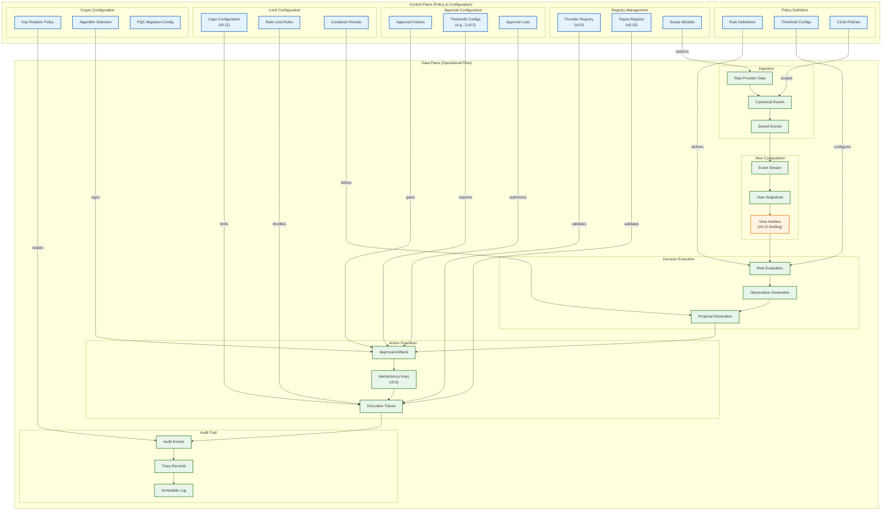
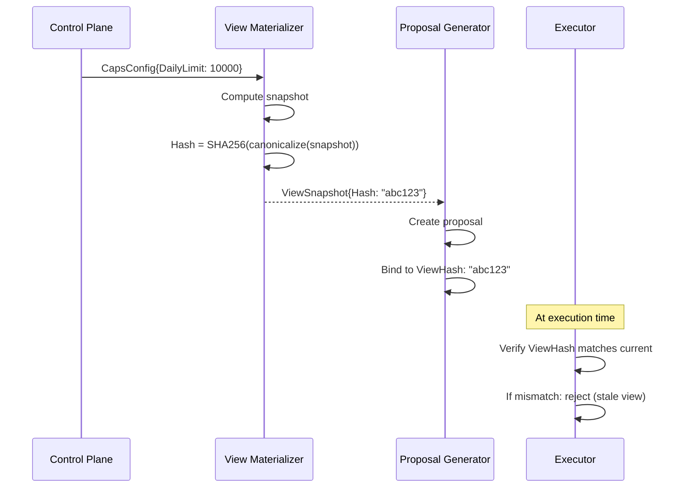
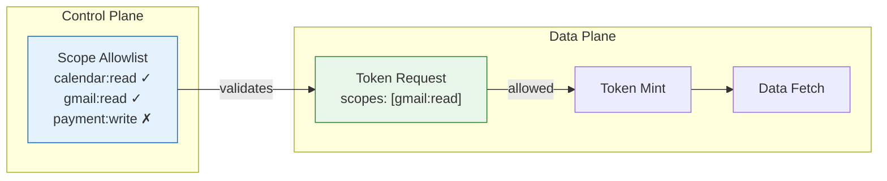
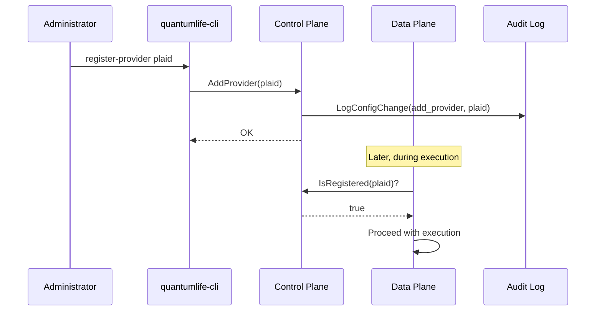

# Control Plane vs Data Plane

Separation of policy/configuration flow (Control Plane) from operational data flow (Data Plane).

## Plane Separation Diagram



## Plane Characteristics

### Control Plane

**Purpose**: Define policies, configurations, and constraints

**Properties**:
| Property | Description |
|----------|-------------|
| Infrequent changes | Configuration changes are rare and deliberate |
| High privilege | Changes require elevated permissions |
| Audited | All changes logged to audit trail |
| Versioned | Configurations have version history |

**Components**:

#### Policy Definition
```go
// Rule definitions loaded at startup
type RuleConfig struct {
    ID          string
    CircleID    string
    Condition   string  // Deterministic predicate
    Observation string  // Template for observation text
    Priority    int
}
```

#### Registry Management (v9.9/v9.10)
```go
// Provider registry - control plane configuration
type ProviderEntry struct {
    ID           string
    Name         string
    Capabilities []string
    RegisteredAt time.Time
    RegisteredBy string  // Approver who registered
}

// Payee registry - control plane configuration
type PayeeEntry struct {
    ID           string
    Name         string
    AccountHash  string  // Hashed account details
    RegisteredAt time.Time
    RegisteredBy string
}
```

#### Caps Configuration (v9.11)
```go
// Spending caps - control plane configuration
type CapsConfig struct {
    DailyLimitCents   int64
    WeeklyLimitCents  int64
    MonthlyLimitCents int64
    PerTxLimitCents   int64
    CooldownMinutes   int
}
```

### Data Plane

**Purpose**: Process operational data through the system

**Properties**:
| Property | Description |
|----------|-------------|
| High volume | Continuous stream of events |
| Constrained by control | Policies limit what data can do |
| Audited | All operations logged |
| Ephemeral (mostly) | Views recomputable from events |

**Components**:

#### Ingestion
```go
// Canonical event - data plane artifact
type EmailEvent struct {
    EventID     string
    CircleID    string
    Provider    string
    AccountID   string
    MessageID   string
    Subject     string
    From        EmailAddress
    SentAt      time.Time
    CapturedAt  time.Time  // Deterministic clock
}
```

#### View Computation (v9.12/v9.13)
```go
// View snapshot with hash binding
type ViewSnapshot struct {
    CircleID    string
    ComputedAt  time.Time
    Hash        string  // SHA-256 of canonical content
    Content     ViewContent
}

// Proposal binds to view hash
type Proposal struct {
    ID           string
    ViewHash     string  // v9.12 binding
    ViewFreshness time.Time  // v9.13 binding
    Action       ActionSpec
}
```

#### Execution Trace
```go
// Execution trace - data plane artifact
type ExecutionTrace struct {
    TraceID        string
    ActionID       string
    IdempotencyKey string  // v9.6
    ProviderID     string  // Validated against registry
    PayeeID        string  // Validated against registry
    ApprovalIDs    []string
    Result         ExecutionResult
    AuditEvents    []AuditEvent
}
```

## Control Plane → Data Plane Binding

### Policy Snapshot Hash Binding (v9.12)



### Scope Allowlist Enforcement



## Separation Benefits

| Benefit | Description |
|---------|-------------|
| **Auditability** | Policy changes are infrequent and logged separately from high-volume data |
| **Security** | Elevated privileges for control plane, standard privileges for data plane |
| **Rollback** | Policy configurations can be versioned and rolled back |
| **Testing** | Data plane can be tested with different control plane configs |
| **Compliance** | Clear separation for regulatory requirements |

## Anti-Patterns (What NOT to Do)

### 1. Policy in Data
```go
// BAD: Embedding policy decisions in data processing
func ProcessTransaction(tx Transaction) {
    if tx.Amount > 10000 {  // Magic number in code
        // ...
    }
}

// GOOD: Policy from control plane
func ProcessTransaction(tx Transaction, caps CapsConfig) {
    if tx.Amount > caps.PerTxLimitCents {
        // ...
    }
}
```

### 2. Data Affecting Policy
```go
// BAD: Data modifying policy at runtime
func ProcessTransaction(tx Transaction) {
    if tx.IsLarge() {
        caps.PerTxLimitCents = tx.Amount + 1  // Modifying policy!
    }
}

// GOOD: Policy is immutable during data processing
func ProcessTransaction(tx Transaction, caps CapsConfig) {
    // caps is read-only, cannot be modified
    if tx.Amount > caps.PerTxLimitCents {
        return ErrExceedsCap
    }
}
```

### 3. Missing Binding
```go
// BAD: Proposal without view binding
type Proposal struct {
    Action ActionSpec
    // No ViewHash - can execute against stale view!
}

// GOOD: Proposal bound to view hash (v9.12)
type Proposal struct {
    Action    ActionSpec
    ViewHash  string     // Must match current view
    ViewTime  time.Time  // v9.13 freshness
}
```

## Configuration Flow Example



## Related

- [ARCH_BLOCK_L0.md](ARCH_BLOCK_L0.md) - Component overview
- [TRUST_BOUNDARIES.md](TRUST_BOUNDARIES.md) - Security zones
- [CLOSED_LOOP_LIFECYCLE.md](CLOSED_LOOP_LIFECYCLE.md) - Lifecycle stages
