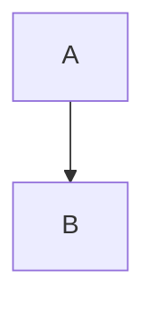

# QuantumLife Canon Diagrams

This directory contains architectural diagrams for the QuantumLife Canon system.
All diagrams use Mermaid syntax and render directly in GitHub.

## Diagram Index

| Diagram | Purpose | Key Concepts |
|---------|---------|--------------|
| [ARCH_BLOCK_L0.md](ARCH_BLOCK_L0.md) | Level 0 system block diagram | All major components, guardrail boundaries |
| [CLOSED_LOOP_LIFECYCLE.md](CLOSED_LOOP_LIFECYCLE.md) | Complete lifecycle flow | Sense→Normalize→Identity→Store→View→Decide→Propose→Approve→Execute→Audit→Learn |
| [TRUST_BOUNDARIES.md](TRUST_BOUNDARIES.md) | Security trust boundaries | Device, Backend, Providers, Credential Vault, Canon Core |
| [CONTROL_DATA_PLANE.md](CONTROL_DATA_PLANE.md) | Control vs Data plane separation | Policy flow vs operational data flow |

## Existing Mermaid Source Files

The `.mmd` files in this directory are raw Mermaid source files for tooling integration:

| File | Description |
|------|-------------|
| `01_high_level_architecture.mmd` | System overview |
| `02_event_flow.mmd` | Event processing pipeline |
| `03_circle_model.mmd` | Circle relationship model |
| `04_ingestion_pipeline.mmd` | Data ingestion flow |
| `05_view_materialization.mmd` | View computation |
| `06_decision_flow.mmd` | Decision engine |
| `07_action_execution.mmd` | Action execution pipeline |
| `08_control_vs_data_plane.mmd` | Plane separation |
| `09_trust_boundaries.mmd` | Security boundaries |
| `10_token_broker.mmd` | OAuth token management |
| `11_identity_resolution.mmd` | Entity identity handling |
| `12_finance_read_flow.mmd` | Financial data ingestion |
| `13_calendar_sync.mmd` | Calendar integration |
| `14_email_processing.mmd` | Email processing |

## Canon Guardrail Annotations

Diagrams annotate where Canon v9+ guardrails apply:

- **[CORE]** - Canon core boundary: no background execution, deterministic clock, single trace finalization
- **[WORKER]** - Worker boundary: background execution allowed (cron, schedulers)
- **[GATE]** - Multi-party approval gate required for execution
- **[IDEMPOTENT]** - Idempotency key required for replay defense
- **[REGISTRY]** - Provider/Payee registry lock enforced

## Rendering

All `.md` diagrams use fenced Mermaid blocks:

```markdown

```

These render automatically in GitHub, GitLab, and most Markdown viewers.

## Related Documentation

- [ARCHITECTURE_LIFE_OS_V1.md](../ARCHITECTURE_LIFE_OS_V1.md) - Full architecture specification
- [CANON_CORE_V1.md](../CANON_CORE_V1.md) - Canon core principles
- [TECHNICAL_SPLIT_V1.md](../TECHNICAL_SPLIT_V1.md) - Technical architecture details
