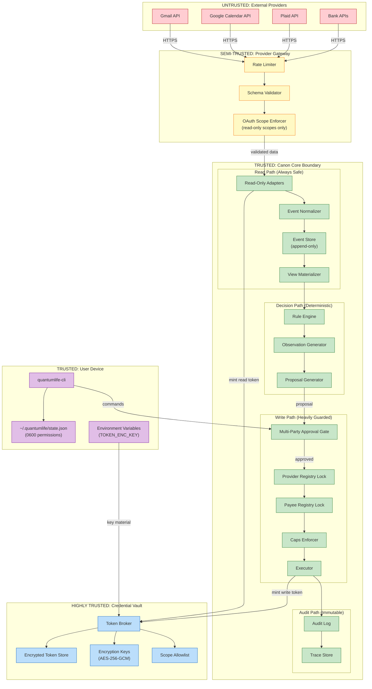
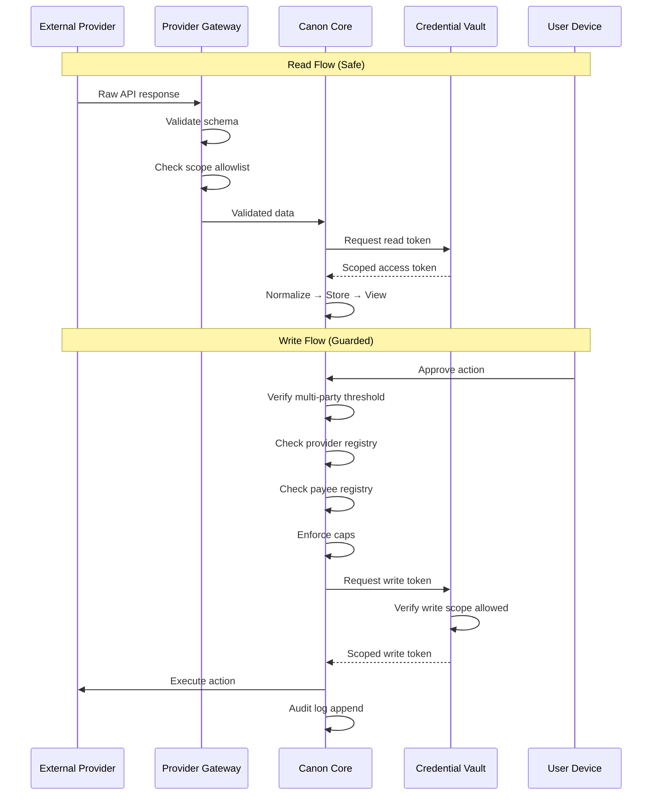

# Trust Boundaries

Security trust zones in QuantumLife Canon: Device, Backend, Providers, Credential Vault, Canon Core.

## Trust Boundary Diagram



## Trust Zones Explained

### 1. UNTRUSTED: External Providers

**Components**: Gmail API, Google Calendar API, Plaid API, Bank APIs

**Trust Level**: Zero trust

**Threats**:
- Malformed responses
- Injection attacks in data
- Rate limit abuse
- Token theft attempts

**Mitigations**:
- All data validated at boundary
- No raw provider data reaches core
- Read-only OAuth scopes enforced
- No provider-specific code in core

### 2. SEMI-TRUSTED: Provider Gateway

**Components**: Rate Limiter, Schema Validator, OAuth Scope Enforcer

**Trust Level**: Validated but not trusted

**Responsibilities**:
| Component | Protection |
|-----------|------------|
| Rate Limiter | Prevent API abuse, respect provider limits |
| Schema Validator | Reject malformed data before normalization |
| Scope Enforcer | Verify OAuth scopes match allowlist |

**Scope Allowlist** (from v9.8):
```go
// Allowed read scopes
var AllowedReadScopes = []string{
    "https://www.googleapis.com/auth/gmail.readonly",
    "https://www.googleapis.com/auth/calendar.readonly",
    "transactions:read",
    "accounts:read",
}

// REJECTED write scopes (hard block)
var RejectedWriteScopes = []string{
    "https://www.googleapis.com/auth/gmail.send",
    "payment:write",
    "transfer:initiate",
}
```

### 3. TRUSTED: Canon Core Boundary

**Components**: All core processing components

**Trust Level**: Trusted (but still defense-in-depth)

**Sub-zones**:

#### Read Path (Always Safe)
- Read-only adapters, event normalization
- No side effects, no external writes
- Safe to retry, safe to parallelize

#### Decision Path (Deterministic)
- Rule engine, observation generator
- Deterministic: same input → same output
- No randomness, no network calls

#### Write Path (Heavily Guarded)
- Multi-party approval required
- Provider/payee registry locks
- Caps and rate limits enforced
- Idempotent execution only

#### Audit Path (Immutable)
- Append-only audit log
- Trace finalization before return
- No deletions, no modifications

### 4. HIGHLY TRUSTED: Credential Vault

**Components**: Token Broker, Encryption Keys, Token Store, Scope Allowlist

**Trust Level**: Highest trust

**Security Properties**:
| Property | Implementation |
|----------|----------------|
| Encryption at rest | AES-256-GCM with authenticated encryption |
| Key isolation | TOKEN_ENC_KEY in environment only |
| Scope enforcement | Allowlist before token mint |
| Handle indirection | Opaque handle IDs, never raw tokens in logs |

### 5. TRUSTED: User Device

**Components**: CLI, State File, Environment Variables

**Trust Level**: Trusted (user-controlled)

**Security Requirements**:
| Requirement | Enforcement |
|-------------|-------------|
| State file permissions | `0600` (owner read/write only) |
| No raw tokens in state | Only opaque handle IDs stored |
| Encryption key in env | `TOKEN_ENC_KEY` not in files |

## Data Flow Across Boundaries



## Boundary Enforcement

### Compile-Time Enforcement

```go
// Read-only adapter interface - NO write methods
type EmailAdapter interface {
    FetchMessages(account string, since time.Time, limit int) ([]*events.EmailEvent, error)
    FetchUnreadCount(account string) (int, error)
    Name() string
}
// Note: No SendMessage, no DeleteMessage, no MarkAsRead
```

### Runtime Enforcement

```go
// Scope allowlist check before token mint
func (b *Broker) MintWriteToken(ctx context.Context, ...) (AccessToken, error) {
    if !b.scopeAllowlist.IsWriteAllowed(provider, scopes) {
        return AccessToken{}, ErrWriteScopeNotAllowed
    }
    // ... continue with token mint
}
```

### Registry Enforcement (v9.9/v9.10)

```go
// Provider must be registered before execution
if !providerRegistry.IsRegistered(action.ProviderID) {
    return ErrUnregisteredProvider
}

// Payee must be registered before payment
if !payeeRegistry.IsRegistered(action.PayeeID) {
    return ErrUnregisteredPayee
}
```

## Threat Model Summary

| Threat | Trust Zone | Mitigation |
|--------|------------|------------|
| Malicious API response | Untrusted→Semi | Schema validation, type-safe parsing |
| Token theft | Semi→Vault | Handle indirection, encryption at rest |
| Unauthorized writes | Core→Provider | Multi-party gate, registry locks, caps |
| Privilege escalation | Any | Scope allowlists, compile-time interface limits |
| Audit tampering | Core→Audit | Append-only log, hash chains |
| State file exposure | Device | 0600 permissions, no raw tokens |

## Related

- [ARCH_BLOCK_L0.md](ARCH_BLOCK_L0.md) - Component overview
- [CONTROL_DATA_PLANE.md](CONTROL_DATA_PLANE.md) - Plane separation
- [../POST_QUANTUM_CRYPTO_V1.md](../POST_QUANTUM_CRYPTO_V1.md) - Cryptographic security
